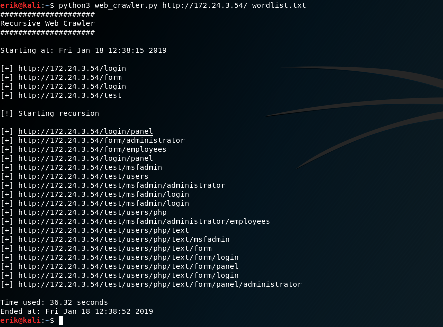
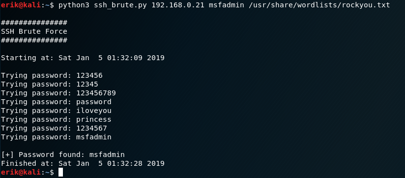

# NetworkingTools

**A summary of different networking tools for all intents and purposes**
------------------------
# web_crawler.py

Use Python to crawl a webserver to find hidden directories using a wordlist

---------------------------------

# ssh_client.py

Use Python as a fully interactive SSH client

----------------------------------

# ssh_brute.py

Use Python to attack the SSH service on a target machine

----------------------------------

# arp_scan.py

Use Python to perform an ARP scan on your local subnet. The script finds the IP and MAC address of hosts that are up

