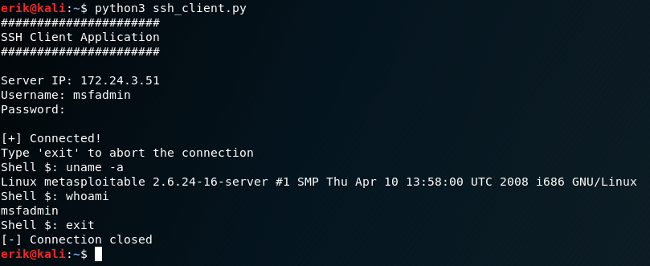
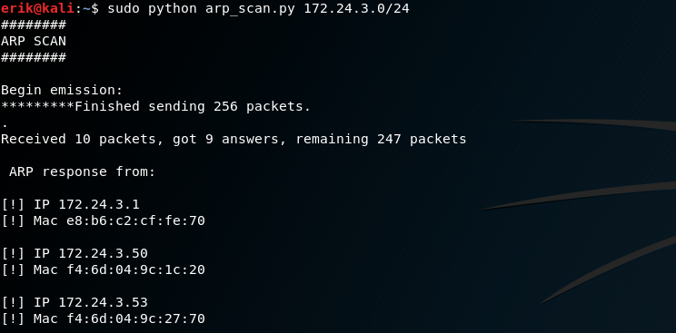

# NetworkingTools
A summary of different networking tools
---------------------------------
# ssh_client.py

Use Python as a fully interactive SSH client

----------------------------------

# arp_scan.py

Use Python to perform an ARP scan on your local subnet. The script finds hosts that are up

